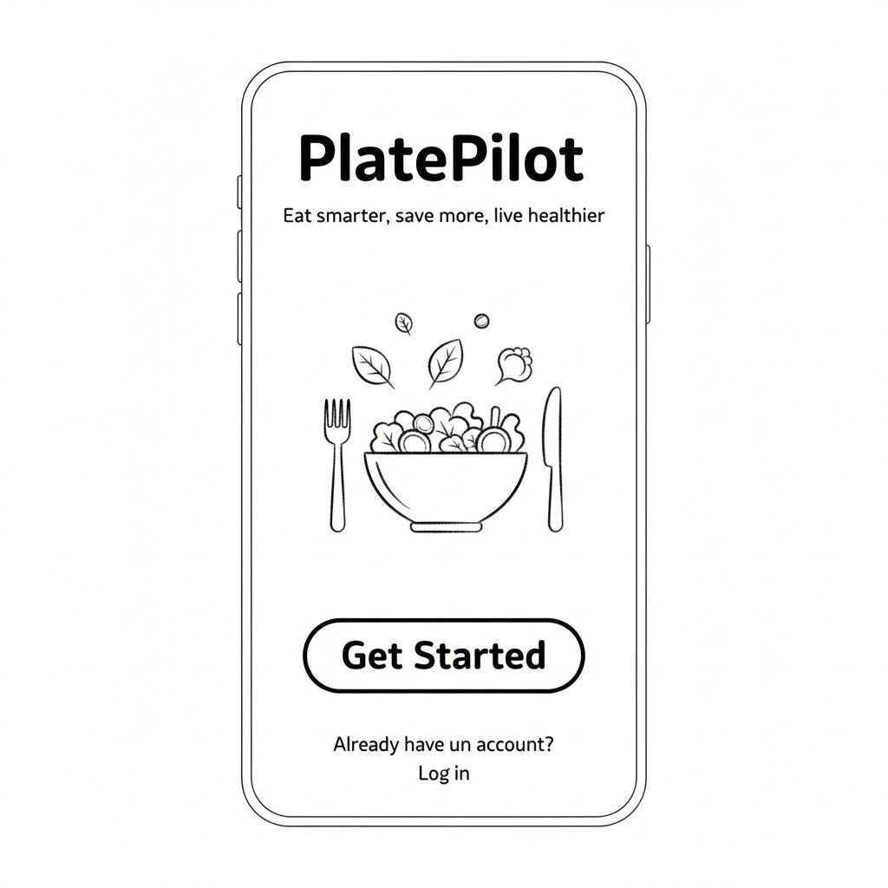
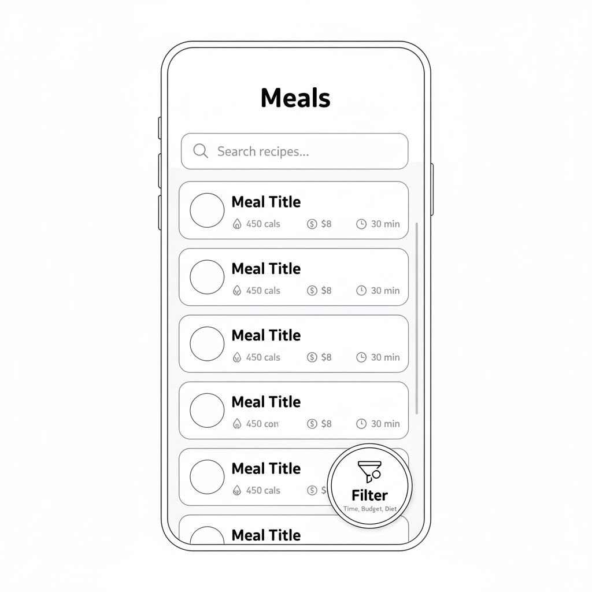
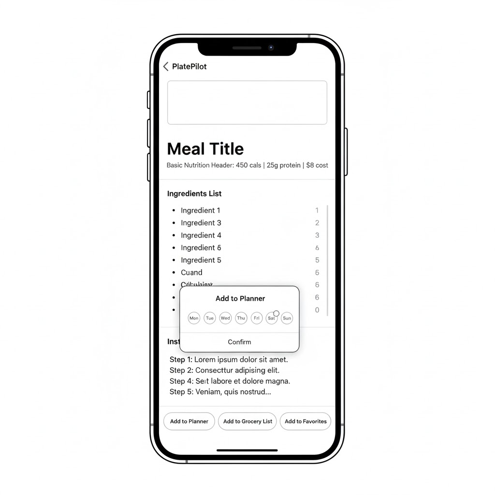
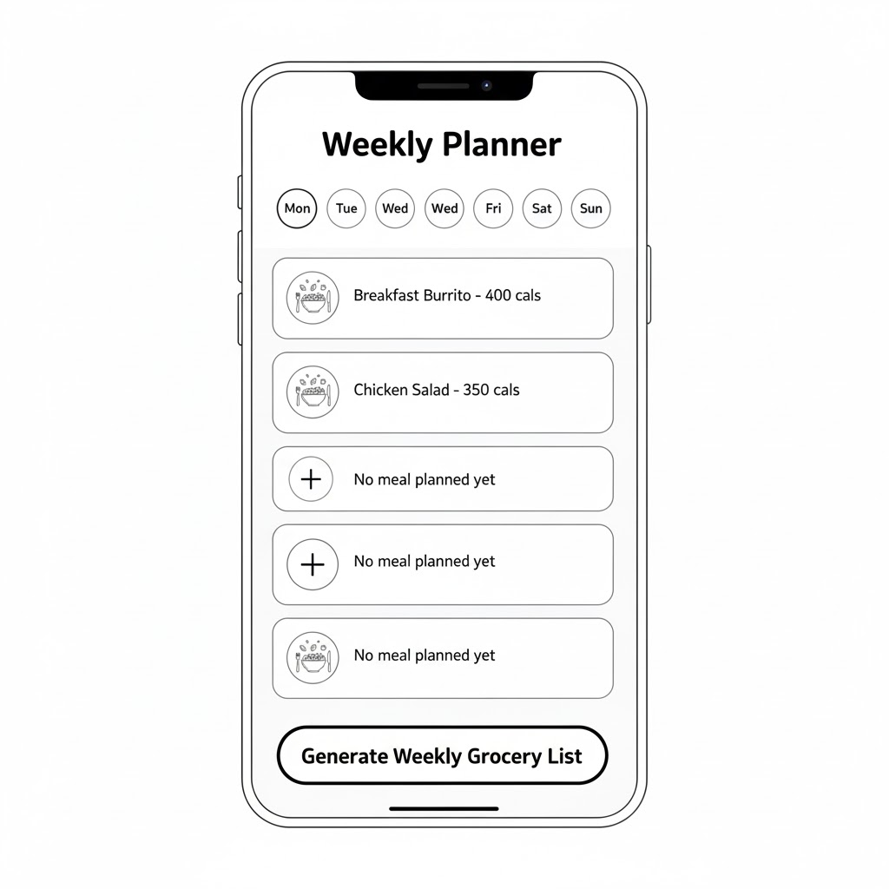
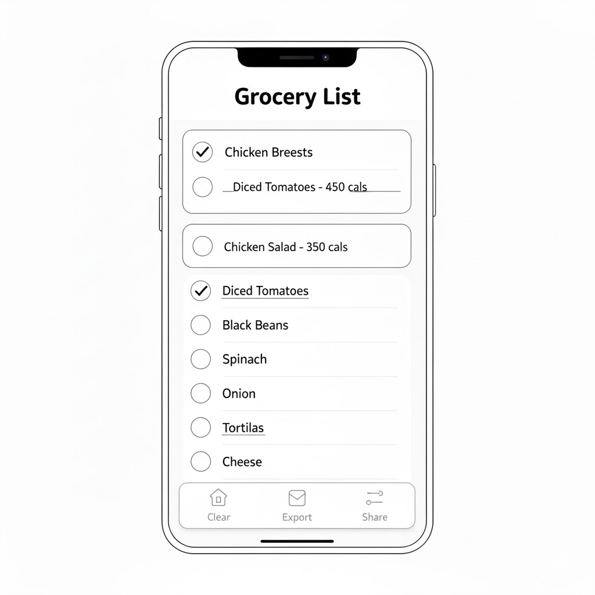
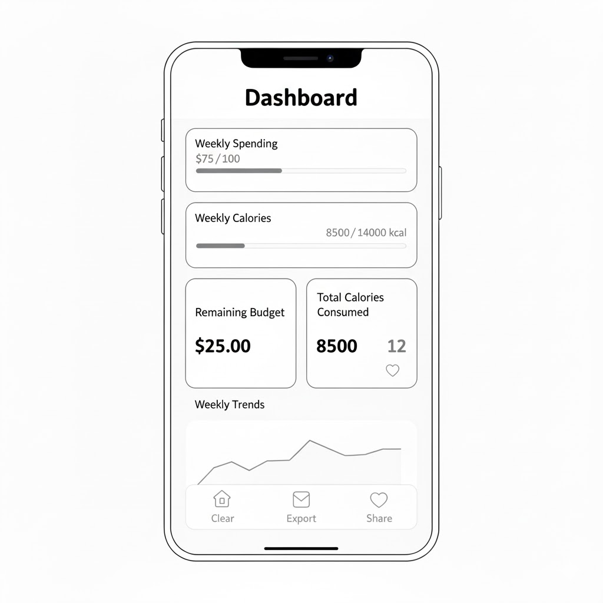
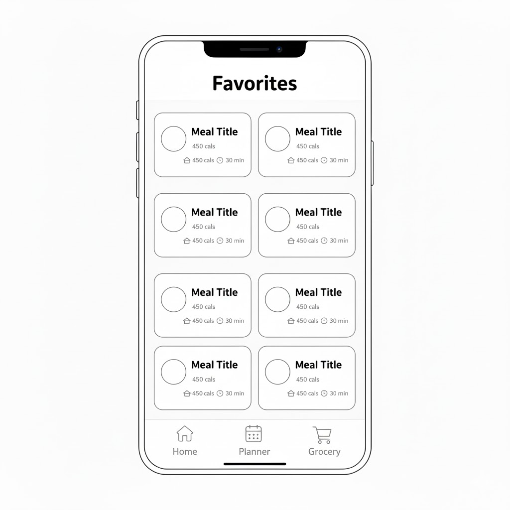
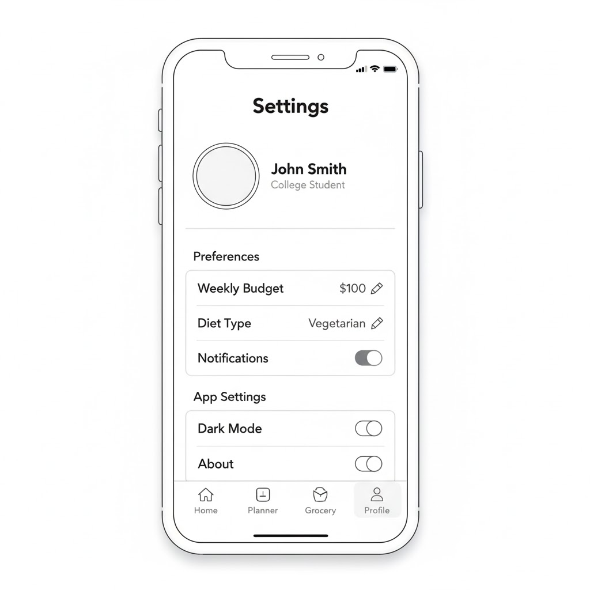

# 🥗 PlatePilot
**Eat smarter. Save more. Live healthier.**  
A smart meal-planning app built for college students to help balance nutrition and budget while organizing weekly meals.

---

## 📱 App Overview
PlatePilot helps students plan weekly meals efficiently based on cost and nutrition. Browse affordable recipes, view ingredients and calories, add meals to a weekly planner, automatically build grocery lists, and track weekly spending and calorie progress.

---

## 🎯 Key Features
- 🍽 Browse meals via recipe API feed
- 📌 Detailed nutrition & cost breakdown for each meal
- 🗓 Weekly planner (Mon–Sun)
- 🛒 Auto-generated grocery list
- 💸 Weekly budget tracking + calorie tracking dashboard
- ⭐ Save meals to favorites
- 💾 Persistence using UserDefaults / CoreData

---

## 🧠 Product Spec

### **1. User Stories**
**Required**
- User can browse meals in a recipe feed
- User can tap a meal to view details
- User can add meals to a weekly planner
- User can view a generated grocery list
- User can track weekly budget & calories
- User can save meals to favorites
- User can persist data locally

**Stretch**
- Search & filtering
- Dark mode support
- Export grocery list
- Notifications reminders

---

### **2. Screen Flow & Wireframes**

#### 🟢 Welcome / Onboarding

#### 🟢 Home Feed / Browse Meals

#### 🟢 Meal Detail View

#### 🟢 Weekly Meal Planner

#### 🟢 Grocery List

#### 🟢 Dashboard

#### 🟢 Favorites

#### 🟢 Profile / Settings

---

### **3. Navigation Structure**
| Screen | Navigation Type |
|--------|----------------|
| Home | Tab |
| Planner | Tab |
| Grocery | Tab |
| Profile | Tab |
| Meal Detail | Push from Home |
| Dashboard | Sub-section or Tab Extension |

---

### **4. Architecture**
| Component | Technology |
|-----------|-----------|
| Framework | UIKit + Storyboards |
| Networking | URLSession / Codable |
| Data Persistence | UserDefaults / CoreData |
| Models | MVC Pattern |
| Navigation | UITabBarController + UINavigationController |
| Reuse | TableViews + Custom Cells |

---

### **5. API**
Using:  
**MealDB** – https://www.themealdb.com/api/json/v1/1/search.php?s=

---

## 🛠 Sprint Planning (3–4 Week Timeline)

### 📍 Sprint Schedule

| Week | Sprint Goal | Deliverables |
|-------|-------------|---------------|
| **Week 1** | Project setup + Core UI framework | Create repo, initial storyboard setup, Tab Bar + placeholder screens, basic navigation flow |
| **Week 2** | Networking + Home Feed | Integrate MealDB API, display recipe feed in TableView, tap-to-detail navigation |
| **Week 3** | Planner + Grocery List + Persistence | Add meal to weekly planner, grocery list generator, persistence with UserDefaults/CoreData |
| **Week 4** | Dashboard + Favorites + Polishing + Demo | Budget & calorie dashboard, favorites, UI styling, final README + GIF demo, bug fixes |

---

## 👨🏾‍💻Developer
**Olaoluwa James-Owolabi**  
*CodePath iOS 101 | Capstone Project | 2025*

---

## 🌟 Inspiration
> Students deserve healthy meals without breaking their budget.  
> PlatePilot makes planning simple, affordable, and structured.

---
